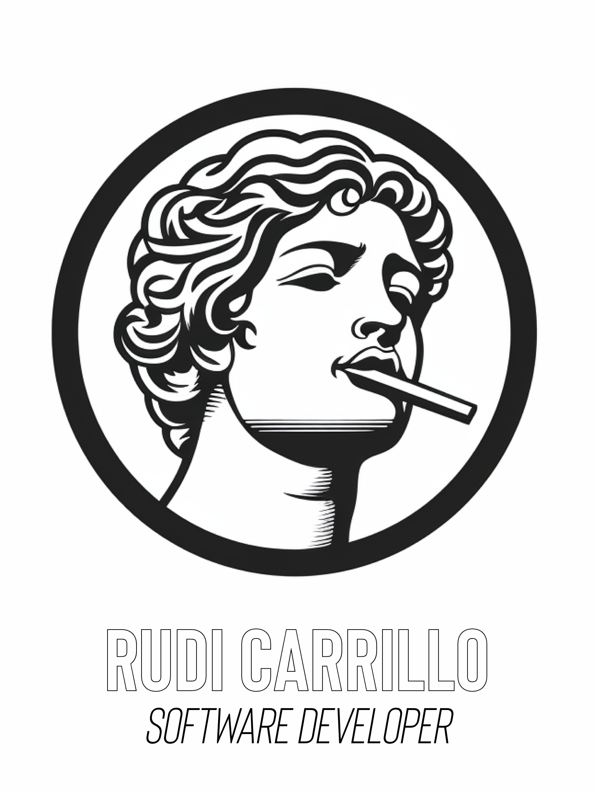

<a name="readme-top"></a>

<div align="center">
   
  <br/>

  <h3><b>📋 To-Do List 📋</b></h3>

</div>

<!-- TABLE OF CONTENTS -->

# 📗 Table of Contents

- [📖 About the Project](#about-project)
  - [🛠 Built With](#built-with)
    - [Tech Stack](#tech-stack)
    - [Key Features](#key-features)
  - [🚀 Live Demo](#live-demo)
- [💻 Getting Started](#getting-started)
  - [Setup](#setup)
  - [Prerequisites](#prerequisites)
  - [Install](#install)
  - [Usage](#usage)
  - [Run tests](#run-tests)
  - [Deployment](#deployment)
- [👥 Authors](#authors)
- [🤝 Contributing](#contributing)
- [⭐️ Show your support](#support)
- [❓ FAQ (OPTIONAL)](#faq)
- [📝 License](#license)

<!-- PROJECT DESCRIPTION -->

# 📖 Awesome To-Do List <a name="about-project"></a>

**Awesome To-Do List** is a basic To-Do List project built using webpack, JavaScript, HTML, and CSS. It allows users to create, manage, and track their daily tasks or to-do items. This README file provides an overview of the project and explains how to set it up and run it on your local machine.

## 🛠 Built With <a name="built-with"></a>

### Tech Stack <a name="tech-stack"></a>

<details>
  <summary>Client</summary>
  <ul>
    <li><a href="#">JavaScript</a></li>
  </ul>
</details>

<details>
  <summary>Server</summary>
  <ul>
    <li><a href="#">Local Storage</a></li>
  </ul>
</details>

<details>
<summary>Database</summary>
  <ul>
    <li><a href="#">JavaScript</a></li>
  </ul>
</details>

<!-- Features -->

### Key Features <a name="key-features"></a>
- [X] **Create a new task**
- [X] **Mark a task as completed**

<p align="right">(<a href="#readme-top">back to top</a>)</p>

<!-- LIVE DEMO -->

## 🚀 Live Demo <a name="live-demo"></a>

[Click here](https://rudicarrilloypr.github.io/todo-list/dist/) to see the project's deployment on GitHub pages.

<p align="right">(<a href="#readme-top">back to top</a>)</p>

<!-- GETTING STARTED -->

## 💻 Getting Started <a name="getting-started"></a>
To get a local copy up and running, follow these steps.

### Prerequisites
Before you proceed, ensure that you have the following installed on your machine:
- Node.js (v12 or above)
- npm (Node Package Manager)

### Setup
Clone this repository to your desired folder:

```sh
  git clone git@github.com:sergio-usma/To-Do-List.git
```

### Install

Install the project dependencies with:

```sh
  npm install
```

### Usage

To run the project, execute the following command:

```sh
  npm run build
```

### Run tests

To run tests, run the following command:
```sh
  npm run start
```
- Open your web browser and visit http://localhost:8080.
- You should now see the To-Do List application running in your browser.

### Deployment

You can deploy this project using:

```sh
  npm run deploy
```

<p align="right">(<a href="#readme-top">back to top</a>)</p>

<!-- AUTHORS -->

## 👥 Authors <a name="authors"></a>

👤 **Author**

- GitHub: [@rudicarrilloypr](https://github.com/rudicarrilloypr)
- Twitter: [@__rudicarrillo](https://twitter.com/__rudicarrillo)
- LinkedIn: [Rudi Carrillo](https://www.linkedin.com/in/rudi-carrillo/)
- Instagram: [@__rudicarrillo](https://www.instagram.com/_rudicarrillo/)


<p align="right">(<a href="#readme-top">back to top</a>)</p>

<!-- CONTRIBUTING -->

## 🤝 Contributing <a name="contributing"></a>

Contributions are welcome! If you find any bugs or want to enhance the project with new features, please follow these steps:

1. Fork the repository.
2. Create a new branch for your feature or bug fix.
3. Make the necessary changes and commit them.
4. Push your changes to your forked repository.
5. Submit a pull request describing your changes.

Feel free to check the [issues page](../../issues/).

<p align="right">(<a href="#readme-top">back to top</a>)</p>

<!-- SUPPORT -->

## ⭐️ Show your support <a name="support"></a>

If you like this project, please consider supporting us! Your support helps us to continue developing and improving our project for everyone to enjoy. Whether it's a small donation, sharing the project with your friends, or contributing your skills and expertise, every little bit makes a huge difference. With your support, we can create something truly amazing together. Thank you for being a part of our community and helping us to make a difference!

<p align="right">(<a href="#readme-top">back to top</a>)</p>

<!-- FAQ (optional) -->

## ❓ FAQ (OPTIONAL) <a name="faq"></a>
- **How do I set up the project?**

  - Clone the repository from GitHub, and see the [Setup](#setup) section above for details.

- **How can I contribute to the project?**

  1. Fork the repository on GitHub.
  2. Create a new branch for your changes using git checkout -b my-feature-branch.
  3. Make your changes and commit them with descriptive commit messages.
  4. Push your changes to your forked repository.
  5. Submit a pull request to the original repository.
  6. Wait for feedback and iterate on your changes as needed.

<p align="right">(<a href="#readme-top">back to top</a>)</p>

<!-- LICENSE -->

## 📝 License <a name="license"></a>

This project is [MIT](./LICENSE.txt) licensed.

_NOTE: we recommend using the [MIT license](https://choosealicense.com/licenses/mit/) - you can set it up quickly by [using templates available on GitHub](https://docs.github.com/en/communities/setting-up-your-project-for-healthy-contributions/adding-a-license-to-a-repository). You can also use [any other license](https://choosealicense.com/licenses/) if you wish._

<p align="right">(<a href="#readme-top">back to top</a>)</p>